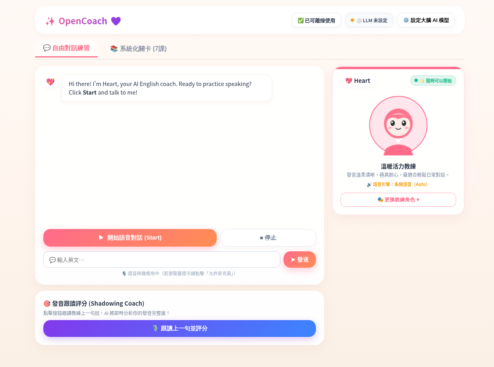
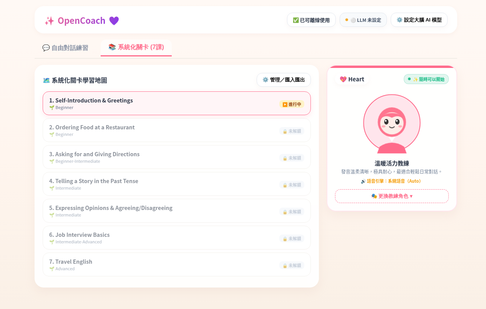
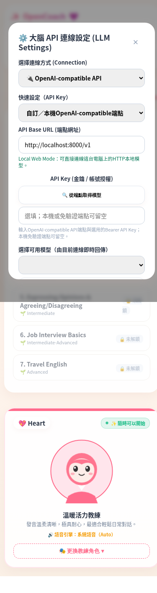

# OpenCoach

OpenCoach is a local-first, cross-platform voice-practice application. It shares one web user interface across the browser, Electron desktop, iOS, and Android while keeping platform-specific speech and credential handling behind typed adapters.

The application was previously developed under the working name **Voice Practice Unified**. Some package names and application identifiers retain that name for compatibility.

## Screenshots



<table>
  <tr>
    <td width="68%"></td>
    <td width="32%"></td>
  </tr>
  <tr>
    <td align="center"><strong>Structured learning map</strong><br>Seven built-in lessons with local progress and unlock states.</td>
    <td align="center"><strong>Responsive model settings</strong><br>Choose a local or cloud endpoint; credentials are optional for local services.</td>
  </tr>
</table>

> The screenshots show a fresh local installation. `LLM not configured` is the expected state until the user explicitly selects a local endpoint or configures a cloud provider.

## Project status

OpenCoach is open-source beta software. The source tree is suitable for development and review, but there is currently **no signed public desktop or mobile release**.

| Target | Source status | Public binary status |
|---|---|---|
| Browser / PWA | Available | Build from source |
| Electron desktop | Available | Unsigned engineering builds only |
| Windows native voice | Source and reproducible build inputs available | No public runtime/model bundle |
| macOS native voice | Source available; packaging dependencies require separate license review | No public binary |
| iOS | Source available | Signing and real-device release gates not completed |
| Android | Source available | Signing and real-device release gates not completed |

See [Release status](docs/RELEASE_STATUS.md) for the exact boundaries.

## Features

- Shared browser/Electron/mobile WebView user interface
- Local-first course library, progress, settings, STT, and TTS
- Browser speech adapters and local model support
- Persistent native desktop voice sidecar
- Windows faster-whisper and Kokoro ONNX engineering path
- iOS and Android typed native bridges
- OpenAI-compatible API-key or local endpoint route
- Desktop-only typed subscription-auth boundaries for explicitly supported providers
- Apple Foundation Models as an iOS-only platform-local provider

OpenCoach does not silently upload audio when a local speech backend fails. Cloud LLM requests occur only when the user configures and selects a remote provider.

## Security model

- Electron uses `contextIsolation`, sandboxing, a narrow preload API, and sender checks.
- Provider credentials are not exposed to the renderer by desktop credential stores.
- Mobile credentials remain in platform-protected storage.
- Native voice uses bounded typed messages, request IDs, cancellation, and process cleanup.
- Runtime/model manifests fail closed until trusted artifacts are explicitly configured.
- Browser API keys are bound to their normalized endpoint and cleared when the endpoint changes.

Please report vulnerabilities through [GitHub private vulnerability reporting](SECURITY.md), not a public issue.

## Quick start

### Requirements

- Node.js 22
- npm
- Python 3.11+ for source tests and local web serving
- `uv` for native Python runtime setup

### Install and test

```bash
git clone https://github.com/kentlincku/opencoach.git
cd opencoach
npm ci
npm test
```

The test command builds generated web assets, runs Python and Node tests, and checks JavaScript syntax.

### Browser / Local Web Mode

```bash
npm run start:web
```

Open <http://127.0.0.1:8765>. The server listens on loopback and does not proxy LLM requests or read API keys. A local OpenAI-compatible service can be configured explicitly, for example `http://127.0.0.1:8000/v1`.

A Hosted HTTPS deployment may access a local endpoint only where the browser's Local Network Access and mixed-content policies permit it; requests still go directly from the browser and are not proxied by OpenCoach.

### Electron development mode

```bash
npm start
```

Native speech backends require the platform-specific runtime setup described in:

- [Windows installation and engineering build](docs/install-windows.md)
- [macOS installation and engineering build](docs/install-macos.md)
- [iOS source setup](docs/install-ios.md)
- [Android source setup](docs/install-android.md)

## Native runtime and model policy

This Git repository intentionally excludes:

- installers and portable executables
- DMG, ZIP, app bundles, and packaged runtimes
- Whisper/Kokoro model weights and voice data
- generated Python wheels
- credentials, recordings, caches, and raw device logs

Windows faster-whisper is prepared from a pinned upstream Git commit plus the reviewable patch in [`patches/`](patches/). Generated runtime artifacts remain local and are validated separately.

Model weights and release assets keep their upstream licenses; the repository's Apache-2.0 license does not relicense them. See [Third-party notices](THIRD_PARTY_NOTICES.md).

## Repository layout

```text
apps/web/        shared web/PWA user interface
apps/desktop/    Electron main, preload, security, and lifecycle
apps/ios/        iOS app shell and native adapters
apps/android/    Android app shell and native adapters
native/python/   desktop native voice sidecar
contracts/       cross-runtime JSON contracts
schemas/         artifact manifest schemas
scripts/         build and verification tools
tests/           source-level product and security tests
docs/            architecture, setup, and release boundaries
legal/           detailed third-party license material
```

See [ARCHITECTURE.md](ARCHITECTURE.md) for runtime and trust-boundary details.

## Contributing

Read [CONTRIBUTING.md](CONTRIBUTING.md). Changes to credential handling, Electron IPC, native bridges, artifact verification, or release workflows require tests that exercise the relevant trust boundary.

## License

OpenCoach's original source code is licensed under the [Apache License 2.0](LICENSE), except where a file or directory carries a different notice.

Derived and third-party components remain under their original licenses. In particular, the in-tree Kokoro ONNX adapter contains MIT-licensed upstream-derived portions. See [NOTICE](NOTICE) and [THIRD_PARTY_NOTICES.md](THIRD_PARTY_NOTICES.md).
