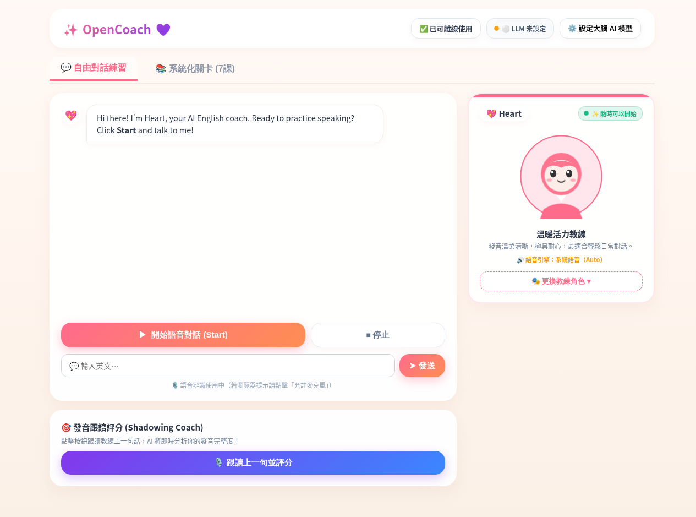
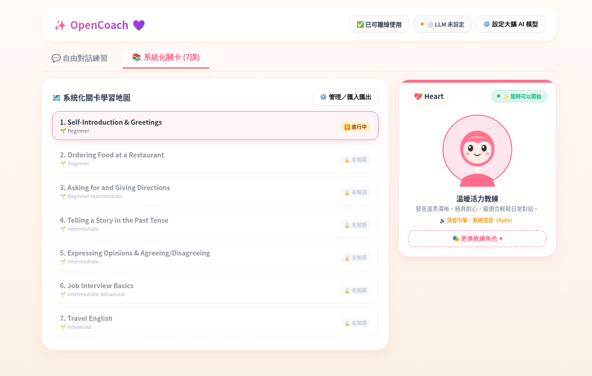
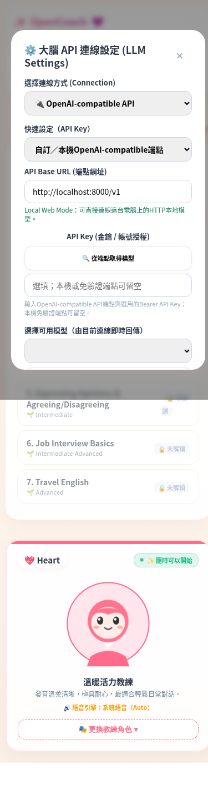

# OpenCoach

OpenCoach is a local-first English speaking coach. You talk, it listens with on-device speech recognition, an LLM of your choice replies as one of eight coaches, and the reply is read aloud. Speech stays on your device; the only network call during practice is to the LLM endpoint you configure, which can be a model on your own machine.

The same web interface runs in the browser, in the macOS/Windows desktop App, and inside the iOS App.

> Some package names and App identifiers still use the earlier working name **Voice Practice**.



<table>
  <tr>
    <td width="68%"></td>
    <td width="32%"></td>
  </tr>
  <tr>
    <td align="center"><strong>Lessons</strong><br>Built-in lessons with local progress; editable and exportable.</td>
    <td align="center"><strong>Model settings</strong><br>Local or cloud endpoint; no key needed for local services.</td>
  </tr>
</table>

## Get the App

| Platform | Current version | How |
|---|---|---|
| macOS (Apple Silicon, macOS 13+) | **v0.3.0-beta.1** | Download the DMG from [Releases](https://github.com/kentlincku/opencoach/releases) → [install guide](docs/install-macos.md) |
| iOS / iPadOS 17+ | source only | Build and install with Xcode → [install guide](docs/install-ios.md) |
| Windows x64 | v0.2.0-beta.1 | Previous release on [Releases](https://github.com/kentlincku/opencoach/releases) → [install guide](docs/install-windows.md); not yet updated to 0.3 |
| Browser | — | Run from source (`npm run start:web`), see [Development](#development) |

All builds are beta. The macOS App is **not signed with an Apple Developer ID or notarized**: the first launch needs **System Settings → Privacy & Security → Open Anyway**. Verify the download against `SHA256SUMS.txt` first. There is no App Store or TestFlight release.

Android was removed in v0.3.0-beta.1.

## What it does

- **Voice conversation.** Speak, pause, and your turn is sent automatically. The coach replies in text and voice; the microphone reopens only after the reply finishes playing.
- **Eight editable coaches.** Change each coach's name, description, speaking style (sent to the LLM), voice, rate and pitch, or restore the default. On iOS each coach starts with a different system voice that fits its description.
- **Choose your speech-recognition model** (desktop). Four Whisper tiers from tiny (fastest) to large-v3-turbo (most accurate), with a recommendation based on your device's memory and CPU.
- **Models download inside the App** (macOS). Nothing large is bundled: pick a model in Settings, see its size and license, and it downloads from a pinned upstream revision, is checked by SHA-256, and then works offline.
- **Shadowing.** Repeat the coach's last sentence and get a word-match score.
- **Lessons.** Guided practice from an editable lesson library with local progress, import and export.
- **Any OpenAI-compatible LLM.** A local server such as oMLX, Ollama or LM Studio, or a cloud API with your own key. iOS can also use Apple Intelligence on supported devices. The desktop and iOS Apps can optionally sign in with a ChatGPT, Claude or Grok subscription (personal use; see the warning in Settings).

### Speech engines

| | Speech-to-text | Text-to-speech |
|---|---|---|
| macOS App | MLX Whisper (4 tiers, downloaded in the App) | Kokoro (downloaded in the App), or system voices |
| Windows App (0.2) | faster-whisper on CPU/CUDA | Kokoro ONNX, or system voices |
| iOS App | Apple Speech, forced on-device | System voices |
| Browser | Whisper in the browser | Kokoro in the browser, or system voices |

If a local speech engine is unavailable, OpenCoach falls back to another local option or to typing. It never silently sends your audio to a cloud service.

### Browser / Local Web Mode

`npm run start:web` serves the interface on <http://127.0.0.1:8765>. The server listens on loopback only; it does not proxy LLM requests or read API keys. Point Settings at a local OpenAI-compatible service such as `http://127.0.0.1:8000/v1`. A Hosted HTTPS deployment can reach a local endpoint only where the browser's Local Network Access and mixed-content rules allow it; requests always go straight from the browser.

## Privacy and security

- Recordings, transcripts, settings, lessons and progress stay on the device.
- API keys and subscription tokens live in the OS keystore (desktop) or Keychain (iOS); the web interface cannot read them back.
- The desktop App runs with Electron `contextIsolation`, sandboxing and a narrow preload API; the speech runtime is a separate process with a minimal environment.
- Downloaded models are verified file by file before use; the bundled speech runtime is verified against a compiled trust root before it starts.

Report vulnerabilities through [GitHub private vulnerability reporting](SECURITY.md), not a public issue.

## Development

Requirements: Node.js 26, npm, Python 3.11+. Building the macOS speech runtime also needs `uv` and the Xcode command-line tools.

```bash
git clone https://github.com/kentlincku/opencoach.git
cd opencoach
npm ci
python3 -m pip install -r requirements-test.txt
npm test               # web build + Node and Python tests for this platform
npm run start:web      # browser version on http://127.0.0.1:8765
npm start              # desktop App in development mode
```

| Command | Purpose |
|---|---|
| `npm test` | Platform test gate (macOS/Linux: `scripts/run-mac-tests.mjs`; Windows: `scripts/run-win-tests.mjs`) |
| `npm run build:web` | Build the generated web assets |
| `npm run build:icons` | Generate App icons (needed before packaging) |
| `bash scripts/ci-pack-macos.sh <abs-dir>` | Build the macOS App exactly like the release: speech runtime from pinned public sources, pack, ad-hoc seal, DMG + ZIP (20–30 min) |

Pushing a `v*` tag runs `.github/workflows/release.yml`, which builds the macOS App and publishes it with checksums as a pre-release. Pull requests run the tests on Linux, macOS and Windows, a full macOS App build, and the iOS simulator tests.

### Repository layout

```text
apps/web/        shared web interface (also bundled into desktop and iOS)
apps/desktop/    Electron main process, preload, model downloads, runtime management
apps/ios/        iOS App (SwiftUI + WKWebView) and native speech/LLM services
native/python/   desktop speech runtime (Whisper, Kokoro)
resources/       pinned model catalogs and runtime manifests
spikes/          pinned build inputs for the macOS speech runtime
scripts/         build, packaging and test runners
tests/           Node and Python tests
docs/            install guides, architecture, feature specs (docs/contracts/)
```

See [ARCHITECTURE.md](ARCHITECTURE.md) for the runtime and trust boundaries, and [docs/RELEASE_STATUS.md](docs/RELEASE_STATUS.md) for what each release covers.

### What is not in Git

Installers, App bundles, packaged runtimes, model weights, voice data, generated wheels, credentials, recordings and logs are never committed. Models keep their upstream licenses; see [THIRD_PARTY_NOTICES.md](THIRD_PARTY_NOTICES.md).

## Contributing

Read [CONTRIBUTING.md](CONTRIBUTING.md). Changes to credential handling, Electron IPC, native bridges, model or runtime verification, or release workflows need tests that exercise that boundary.

## License

OpenCoach's original source code is licensed under the [Apache License 2.0](LICENSE), except where a file or directory carries a different notice. Third-party components keep their own licenses; the in-tree Kokoro ONNX adapter contains MIT-licensed upstream-derived portions. See [NOTICE](NOTICE) and [THIRD_PARTY_NOTICES.md](THIRD_PARTY_NOTICES.md).
